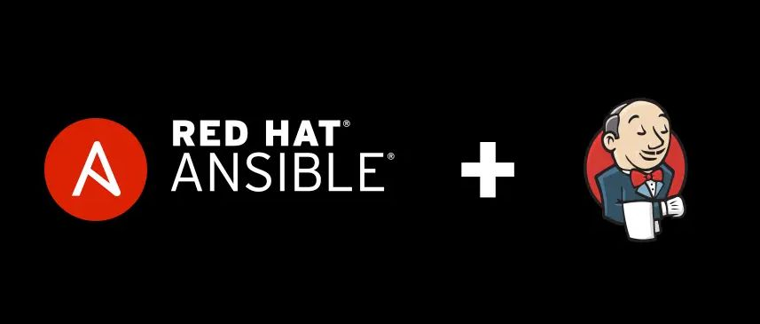

<div align="center" id="top"> 
  

  <!-- <a href="https://jenkinsserveransiblerole.netlify.app">Demo</a> -->
</div>

<h1 align="center"> Jenkins Server Provisioning with Ansible Role </h1>

<p align="center">
  
  
  
  
  <!--  -->
  <!--  -->
  <!--  -->
</p>

<!-- Status -->

<!-- <h4 align="center">
	🚧  Jenkins Server Ansible Role 🚀 Under construction...  🚧
</h4>

<hr> -->

<p align="center">
  <a href="#dart-about">About</a> &#xa0; | &#xa0; 
  <a href="#sparkles-Contents">Contents</a> &#xa0; | &#xa0;
  <a href="#rocket-technologies">Technologies</a> &#xa0; | &#xa0;
  <a href="#white_check_mark-requirements">Requirements</a> &#xa0; | &#xa0;
  <a href="#checkered_flag-starting">Starting</a> &#xa0; | &#xa0;
  <a href="#memo-license">License</a> &#xa0; | &#xa0;
  <a href="https://github.com/devenes" target="_blank">Author</a>
</p>

<br>

## :dart: About

Jenkins Server Provisioning with Ansible Role. Checkout the [main.yml](./roles/jenkins_build/tasks/main.yml) file for steps to use this role.

## :sparkles: Contents

- [:dart: About](#dart-about)
- [:sparkles: Contents](#sparkles-contents)
- [:rocket: Technologies](#rocket-technologies)
- [:white_check_mark: Requirements](#white_check_mark-requirements)
- [:checkered_flag: Starting](#checkered_flag-starting)
- [🚀 Usage](#-usage)
- [💄 Groovy Script](#-groovy-script)
- [:memo: License](#memo-license)

## :rocket: Technologies

The following tools were used in this project:

- [Terraform](https://www.terraform.io/)
- [Ansible](https://www.ansible.com/)

## :white_check_mark: Requirements

Before starting :checkered_flag:, you need to have [Git](https://git-scm.com) and [Terraform](https://www.terraform.io/) installed on your machine.

## :checkered_flag: Starting

```bash
# Clone the project
git clone https://github.com/devenes/jenkins-server-ansible-role.git

# Access the project folder
cd jenkins-server-ansible-role

# Edit your backend, variables and initialize terraform
terraform init

# Run the project with terraform
terraform apply -auto-approve
```

## 🚀 Usage

- Initialize Ansible role with using Ansible Galaxy

```bash
ansible-galaxy init roles/jenkins_build
```

- Encrypt the Jenkins server login password with using Ansible Vault

```bash
ansible-vault encrypt secret.yml
```

- Run the project playbook with Ansible

```bash
ansible-playbook play.yml --ask-vault-pass
```

- Write the Jenkins job to the xml file with using Ansible as management tool

```bash
ansible all -b -m shell -a "sudo java -jar /root/jenkins-cli.jar -s http://localhost:8080/ -auth @/root/jenkinsauth get-job "job_template" > /root/job.xml"
```

- Get the Jenkins job

```bash
ansible all -b -m shell -a "cat /root/job.xml"
```

## 💄 Groovy Script

Write the Groovy script to create the login credentials for the Jenkins server with using Ansible as automation tool.

```groovy
import jenkins.model.*
import hudson.security.*

def instance = Jenkins.getInstance()

println "--> creating local user 'admin'"

def hudsonRealm = new HudsonPrivateSecurityRealm(false)
hudsonRealm.createAccount('admin', '{{ admin_pass }}')
instance.setSecurityRealm(hudsonRealm)

def strategy = new FullControlOnceLoggedInAuthorizationStrategy()
strategy.setAllowAnonymousRead(false)
instance.setAuthorizationStrategy(strategy)
instance.save()
```

## :memo: License

This project is under license from Apache 2.0. For more details, see the [LICENSE](LICENSE) file.

Made with :heart: by <a href="https://github.com/devenes" target="_blank">devenes</a>

&#xa0;

<a href="#top">Back to top</a>
